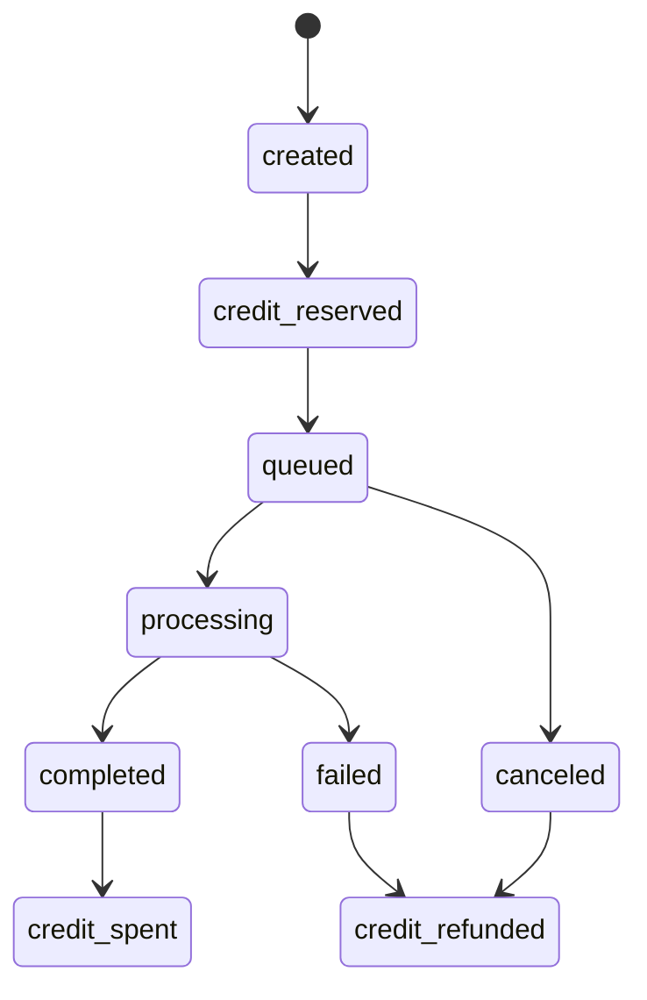

# Generation Lifecycle

## Overview

This document defines the planned lifecycle for image generation jobs in `creato`. Phase 6 is documentation only. The current app has a frontend-only generate UI and does not upload files, call APIs, deduct credits, or generate images.

The future backend must build prompts server-side. The client should send only:

- Product id.
- Uploaded image ids.
- Public option values.

AI provider configuration, prompt versions, prompt mappings, API keys, and internal cost data must stay server-side/admin-only.

## State Machine

Recommended statuses:

- `created`
- `credit_reserved`
- `queued`
- `processing`
- `completed`
- `failed`
- `credit_spent`
- `credit_refunded`
- `canceled`

Suggested high-level flow:

## Success Lifecycle

1. `created`
   - Backend validates product, options, user, and uploaded image references.
2. `credit_reserved`
   - Backend reserves credits with ledger transaction.
3. `queued`
   - Job is queued for async worker.
4. `processing`
   - Worker compiles prompt server-side and calls provider.
5. `completed`
   - Output is saved to protected storage and `generation_outputs` is inserted.
6. `credit_spent`
   - Reserved credits are finalized with a spend ledger transaction.

Public UI can show this as: Pending -> Processing -> Completed.

## Failure Lifecycle

If a job fails after credit reserve:

1. Mark `failed`.
2. Store sanitized error code and admin-only error details.
3. Insert a refund ledger row.
4. Mark `credit_refunded`.

Public UI can show: Failed, credits returned.

## Retry Lifecycle

Retries should be explicit and auditable:

- Use an incrementing `attempt_count` field or separate `generation_attempts` table in a future migration.
- Do not reserve credits again for retrying the same generation attempt unless the user starts a new generation.
- Keep provider error details in admin-only fields.
- Keep idempotency keys per reserve/spend/refund step.

## Fallback Provider Lifecycle

When primary provider fails:

1. Worker records primary provider error.
2. If retry/fallback rules allow, call fallback provider.
3. Store final provider used in admin/backend fields.
4. If fallback succeeds, complete and spend reserved credits.
5. If all providers fail, refund reserved credits.

Public clients should not see provider routing details.

## Input and Output Storage Relationship

Inputs:

- User uploads should go to protected storage.
- `generation_inputs` stores file metadata and storage path.
- Backend validates that input ids belong to the current user.

Outputs:

- Generated images should go to protected storage.
- `generation_outputs` stores output metadata and storage path.
- Public access should use signed URLs or authenticated storage policies.

## Error Logging Strategy

Store two layers of errors:

- Public: simple user-safe status and generic message.
- Admin/backend: provider code, provider response summary, trace id, retry count, and failure stage.

Do not expose raw provider responses to public clients.

## User-Visible Status vs Internal Status

| Internal status | User-visible status |
| --- | --- |
| created | Preparing |
| credit_reserved | Preparing |
| queued | Queued |
| processing | Processing |
| completed | Completed |
| credit_spent | Completed |
| failed | Failed |
| credit_refunded | Failed, credits returned |
| canceled | Canceled |

## Admin Monitoring Requirements

Admin UI should eventually show:

- Job id.
- User.
- Product.
- Internal status.
- Provider and model used.
- Attempt count.
- Credit cost.
- Provider cost.
- Created/completed timestamps.
- Error code.
- Safe retry/refund actions when supported.

## Refund Rules

- If credit was reserved and generation fails, refund.
- If generation is canceled before provider work starts, refund.
- If provider succeeds and output is stored, spend reserved credits.
- If output storage fails after provider success, refund unless the output can be recovered.
- Never leave reserved credits stuck; use timeout recovery jobs.

## Timeout Handling

Timeouts should be handled by a scheduled worker:

- Find jobs stuck in `queued` or `processing` beyond configured timeout.
- Check provider status when possible.
- Complete if output exists.
- Fail and refund if no recoverable output exists.
- Write admin log entry.

## Provider Cost Tracking

Track provider cost for operations reporting:

- Store estimated or actual provider cost in admin/backend fields.
- Do not expose provider cost to public users.
- Keep user credit cost separate from provider cost.
- Use this data for pricing analysis and abuse monitoring.

## Future Async Worker Notes

The future backend should use an async worker pattern:

- API creates generation and reserves credits.
- Worker processes queue.
- Worker stores outputs and updates status.
- Worker spends/refunds credits.
- Worker writes audit logs.

The API should not hold a long browser request open while image generation is running.
